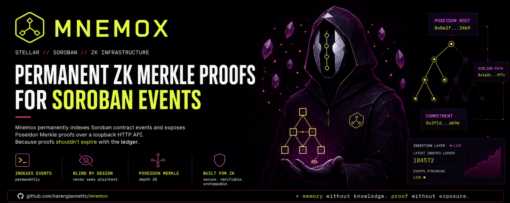
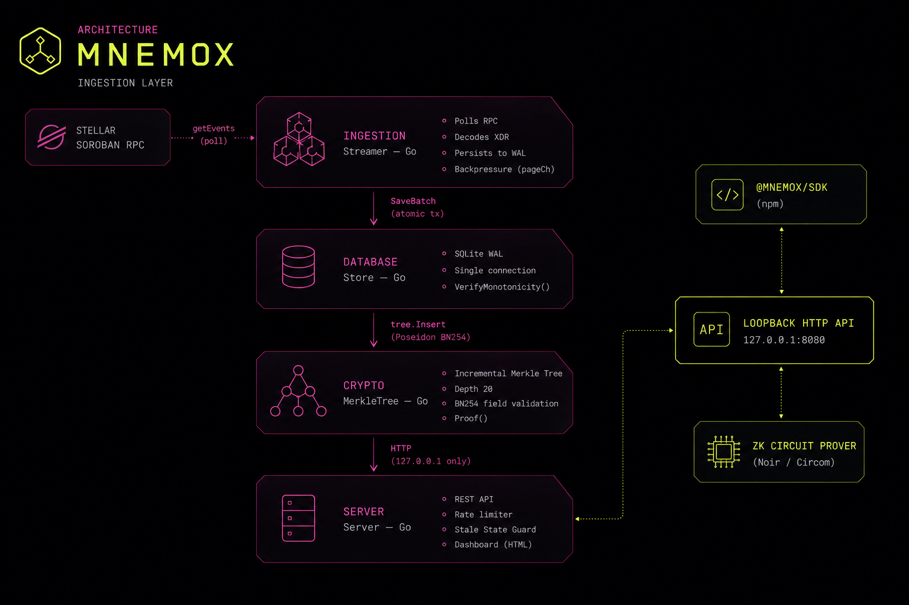

# Mnemox



**Local Data Availability sidecar for ZK circuits on Stellar.**

Mnemox permanently indexes Soroban contract events and exposes Poseidon Merkle proofs over a loopback HTTP API. It exists to close a structural gap in Stellar's infrastructure: Soroban RPC nodes prune event history after approximately seven days, which breaks any ZK circuit whose proof generation depends on a complete, ordered commitment leaf sequence.

Any ZK application that requires an incremental Merkle tree over historical on-chain commitments can use Mnemox as its Data Availability layer. The sidecar is deliberately narrow: it stores only irreversible 32-byte Poseidon BN254 hashes and returns sibling paths — it never sees plaintext witnesses, secrets, or user identities.

Protocol 26 (Yardstick) drastically reduced the on-chain gas costs for verifying ZK proofs using native host functions (BN254 and Poseidon). However, the 7-day ledger pruning window remains a structural bottleneck for historical validation. Mnemox bridges this gap by providing an off-chain Data Availability (DA) layer that secures the required historical witness permanently.

---

## Architecture



---

## Monorepo Layout

```
/
├── cmd/mnemox/main.go          Go entrypoint: wires store, tree, ingestion, server
├── internal/
│   ├── config/config.go        Environment-variable configuration loader
│   ├── crypto/
│   │   ├── poseidon.go         Poseidon BN254 hash wrapper; field element validator
│   │   └── tree.go             Incremental Merkle tree (depth 20, Semaphore pattern)
│   ├── database/
│   │   ├── schema.sql          SQLite schema: events table + WAL cursor
│   │   └── store.go            Atomic SaveBatch, GetCommitments, VerifyMonotonicity
│   ├── ingestion/
│   │   ├── streamer.go         Two-stage producer/consumer pipeline with pageCh backpressure
│   │   └── xdrdecode.go        XDR ScVal → symbol/U256 decoders with BN254 boundary check
│   └── server/
│       ├── server.go           HTTP mux, token-bucket rate limiter
│       ├── handlers.go         /health /tree/root /tree/proof/* /events — Stale State Guard
│       └── assets.go           Embedded dashboard, home, and docs HTML
├── ui/
│   ├── sdk/                    @mnemox/sdk — TypeScript client (see ui/sdk/README.md)
│   │   ├── src/index.ts        MnemoxClient, typed errors, toNoirFormat()
│   │   ├── package.json
│   │   └── tsconfig.json
│   └── src/                    Remotion pitch animation (independent package)
├── scripts/
│   ├── demo.sh                 End-to-end smoke test: health → root → proof
│   └── seed_demo.py            Seeds 237 BN254-valid events for offline demo
├── go.mod                      Go module root (github.com/karengiannetto/mnemox)
├── Makefile
├── SECURITY.md
└── .env.example
```

---

## Configuration

Copy `.env.example` to `.env` and set the required variables before running.

| Variable | Default | Description |
|---|---|---|
| `CONTRACT_ID` | — (required) | Soroban pool contract address to index |
| `STELLAR_RPC_URL` | `https://soroban-testnet.stellar.org` | Soroban JSON-RPC endpoint |
| `DB_PATH` | `./mnemox.db` | SQLite WAL file path |
| `API_PORT` | `8080` | Loopback port the HTTP server binds to |
| `POLL_INTERVAL_MS` | `5000` | RPC polling cadence in milliseconds |
| `START_LEDGER` | `0` (auto) | First ledger to index; 0 probes RPC for oldest retained |
| `NETWORK` | `testnet` | Reflected in `/health` response |

---

## Compilation

Requires Go 1.24+ and a CGO-capable C compiler (`gcc` or `musl-gcc`). CGO is mandatory because `mattn/go-sqlite3` wraps the SQLite C amalgamation — a `CGO_ENABLED=0` build panics at runtime.

```bash
# Development build (native OS, dynamic linking)
make build

# Production build (Linux amd64, glibc, stripped)
make build-prod

# Static build (Linux amd64, musl — requires: apt install musl-tools)
make build-static
```

---

## Local Execution

Mnemox binds exclusively to the loopback interface (`127.0.0.1`) to prevent public exposure of the proof endpoint. Binding to `0.0.0.0` would allow timing-correlation traffic analysis against the ZK deposit pattern.

```bash
# Load .env and run
make run

# Or directly
CGO_ENABLED=1 go run ./cmd/mnemox
```

The API is reachable at `http://127.0.0.1:8080`.

### Offline demo (no live RPC required)

```bash
# 1. Seed 237 BN254-valid commitment events into a local database
python3 scripts/seed_demo.py

# 2. Start with DEMO_MODE=1 to bypass the live RPC sync check
DEMO_MODE=1 make run

# 3. Run the end-to-end smoke test (health → root → proof)
bash scripts/demo.sh
```

`DEMO_MODE=1` short-circuits `assertSyncState` and backdates `uptime_seconds` by 24 h. Never enable in production — see `.env.example`.

---

## API Endpoints

| Method | Path | Description |
|---|---|---|
| `GET` | `/health` | Liveness probe: `status`, `latest_ledger`, `indexed_events`, `uptime_seconds` |
| `GET` | `/tree/root` | Current Poseidon Merkle root, leaf count, latest indexed ledger |
| `GET` | `/tree/proof/:commitment` | Sibling path for a 64-char hex commitment. Returns 503 if local ledger lags network. |
| `GET` | `/events?contract=&from_ledger=&limit=` | Raw indexed event log, paginated |
| `GET` | `/dashboard` | Embedded monitoring dashboard |

---

## TypeScript SDK

Install the client from the local path:

```bash
npm install ./ui/sdk
```

```typescript
import { MnemoxClient, MnemoxDesyncError } from "@mnemox/sdk";

const client = new MnemoxClient({ endpoint: "http://127.0.0.1:8080" });

try {
  // commitmentHash must be 0x-prefixed + exactly 64 hex chars (BN254 field element)
  const proof = await client.getSiblingPath("0x" + commitmentHex64);
  const witness = proof.toNoirFormat(); // ready for Barretenberg / Circom
} catch (err) {
  if (err instanceof MnemoxDesyncError) {
    // Local tree is behind Stellar consensus — retry after backoff
  }
}
```

The Mnemox TypeScript SDK outputs cryptographic witnesses fully padded to 64-character fields (`toNoirFormat`), offering out-of-the-box compatibility with Aztec's Noir DSL and production-grade Soroban UltraHonk verifier contracts.

See [`ui/sdk/README.md`](ui/sdk/README.md) for the full API reference, error handling decision tree, and Noir circuit integration example.

---

## Testing

```bash
# Go unit tests (crypto + database packages)
go test ./...

# SDK typecheck + build
cd ui/sdk && npm run build
```

---

## Security

See [`SECURITY.md`](SECURITY.md) for the cryptographic blindness proof, threat matrix, federated High-Availability quorum model, and host hardening checklist.

---

## Mainnet Production Roadmap & Auditing Targets

Before transitioning Mnemox from Testnet/Futurenet environments into a high-stakes Stellar Mainnet production deployment, the following architecture hardening milestones must be implemented:

### 1. Tree Snapshot Serialization (Storage & Boot Hardening)
* **Current State:** The depth-20 Merkle tree is rehydrated into RAM by scanning the SQLite database sequentially (`ORDER BY ledger ASC, id ASC`) on every cold boot.
* **Production Risk:** Under high Mainnet throughput, log accumulation over months will linearly increase restart rehydration times, introducing unacceptable API downtime during node maintenance.
* **Mitigation:** Implement periodic background tree state snapshotting using a binary serialization format (e.g., Protocol Buffers or raw byte streams). On restart, the memory tree will load the latest snapshot in $O(1)$ and replay only the delta ledgers remaining in the WAL.

### 2. Multi-Node Quorum Federation (Decentralization)
* **Current State:** Mnemox runs as a single-instance infrastructure sidecar bound to a local host.
* **Production Risk:** A localized hardware or network failure turns the single sidecar into a single point of failure (SPOF) for dependent ZK-dApps.
* **Mitigation:** Implement the multi-node Byzantine Fault Tolerant (BFT) quorum federation framework detailed in `SECURITY.md`. Multiple independent Mnemox instances will cross-verify state roots over gossip protocols before finalizing block inclusion.

### 3. Multi-Provider RPC Verification (Data Ingestion Integrity)
* **Current State:** The asynchronous ingestion pipeline polls transactions from a single configured Soroban RPC provider endpoint.
* **Production Risk:** If the target RPC provider suffers a severe desynchronization or a temporary network fork, Mnemox could ingest blocks from an unvalidated chain state.
* **Mitigation:** Implement a multi-endpoint quorum client wrapper. The streaming daemon will compare ledger state hashes across at least 3 distinct RPC node providers before committing XDR events into the SQLite WAL persistence layer.
